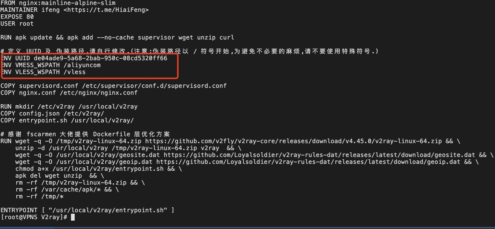

# 1、简介：
本项目用于在 Doprax.com 免费服务上部署 V2ray ，采用的方案为 Nginx + WebSocket + VMess/VLess + TLS。速度与 Replit 相比较慢，但是官方宣传不限流量，服务启动后永不停机。

# 2、服务端快速启动
## 2.1 购买云服务器（海外region）
  - 我用的是aliyun 新加坡区域，AWS（AWS有免费24个月试用）、Azure（访问openAI可以在azure上开通服务器，测试不如AWS体验好）都可以；
  - OS选择：Centos、ubuntu 都可以，我用Amazonlinux 默认；
  - 不需要购买数据盘，系统盘一般20G足够用了（AWS 30G内试用免费）；
  - 使用aliyun服务器，可以使用"实例启动模版"功能非常好用（IP被封重新拉起instance非常快），另外借助"发送命令/文件(云助手)"将编排的code作为初始化工具也不错；【测试发现aliyun开的外部服务不能使用openAI】

## 2.2 修改UUID
  - UUID 是v2ray访问过程中身份认证KEY，初始化之前最好修改下，不要使用默认值（被试出来浪费钱）；

## 2.3启动方法（以aliyun 云助手为例，不需要登录服务器）
  服务器执行
  - 第一步：制作一个自启动模版（方便反复新建instance）【可选】
  - 第二步：可将初始化过程放到 云助手，完成自动初始化（key信息已放到 private中）【可选】



## 安装
- 修改 json配置（根据需要）
- osinit.sh （初始化下OS，通过docker-compose 自行部署）
- 【或者】自己build  run docker

## 2.4 费用节省
  可以考虑使用OSS自动编排，配置自动开关机（配置了 docker  --restart=always）;

# 3、客户端快速配置
## 3.1 客户端下载
```
Linux
https://github.com/v2ray/dist

MAC版本
https://github.com/yanue/V2rayU/releases

WINDOWS
https://github.com/2dust/v2rayN/releases

安卓
https://github.com/2dust/v2rayNG/releases

Iphone 
国外苹果账号认证（参考：https://sypai.net/1018.html），下载v2box（免费）

```

## 3.2 客户端配置

### 3.2.1 Linux x64 客户端配置方法
```
1、下载 ： wget https://raw.githubusercontent.com/v2ray/dist/master/v2ray-linux-64.zip

2、解压缩 ： config.json 为配置文件

3、获取配置：最好的方法是本地通过界面（mac、windows）确认可通后，页面获取配置 贴入/替换 config.json

4、./v2ray  test  检查配置文件是否正确

5、./v2ray run   读取默认 config.json 配置文件，并启动proxy

6、测试：我配置默认http_proxy 1087端口
  - curl https://google.com   不加代理
  - curl https://google.com  -x 127.0.0.1:1087   使用proxy 请求
  - 
```


### 3.2.2 Macos 客户端配置方法

V2rayU为例：


###  3.2.3 Windows客户端配置方法

<p>节点客户端配置需要手动进行，下面以 V2rayN 为例。
<p>下图为 VMess 配置示意图，请修改标示内容，其他设置与图片中显示一致。</p>

<p>下图为 VLess 配置示意图，请修改标示内容，其他设置与图片中显示一致。</p>


# 4、参考

## 4.1 PAC
Proxy Auto-Configuration（PAC）是一种用于自动选择代理服务器的网络配置技术

如果使用中想将入某些domian走proxy（PAC模式），“偏好设置” —> "PAC" 加入

# 如 servicenow.i.mercedes-benz.com 走 proxy, 按照以下格式加入。重启v2ray生效
||servicenow.i.mercedes-benz.com

```
PAC：https://github.com/gfwlist/gfwlist

默认 PAC ： https://raw.githubusercontent.com/gfwlist/gfwlist/master/gfwlist.txt

issue 提到：https://raw.githubusercontent.com/Loukky/gfwlist-by-loukky/master/gfwlist.txt
```

## 4.2 GFW
访问V2ray Server过程，如果发现请求无法到达Server，可能是被GFW墙了。
可以考虑使用tailscale（或其它内穿产品）将server 与client放到一个内穿网内，可以解决。

# 5、Secure：
## 5.1 quick clone
```
git clone https://github.com/ryanlxb/v2ray-server.git
```

## 5.2 quick connect
```
公网：ec2-3-1-49-171.ap-southeast-1.compute.amazonaws.com

内网：YOUR_TAILSCALE_IP

de04ade9-5a68-2bab-950c-08cd5320ff66

VMESS_WSPATH /aliyuncom

VLESS_WSPATH /vless
```
