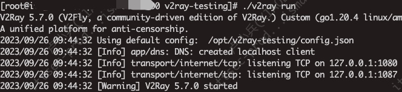
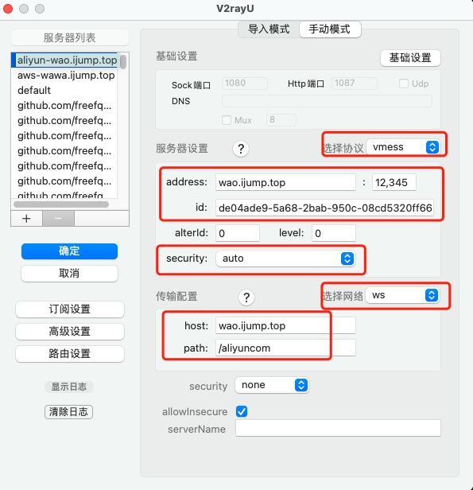

# 1、简介：
总结下近期翻墙的一些经验，只看README就行。

# 2、服务端快速启动
## 2.1 购买云服务器（海外region）
  - AWS 海外有24个月的免费credit
  - 如果是国内服务器，使用YONGGE脚本理论上也是可以使用的（未曾尝试过）


## 2.2 安装（新）
一键部署：bash <(curl -Ls https://gitlab.com/rwkgyg/CFwarp/raw/main/CFwarp.sh)

部署完，会有UI 端口。

服务端使用reality 方式，避免server 端口被封。


# 3、客户端快速配置
## 3.1 客户端下载
```
Linux（xray 支持 reality，避免反复端口被封的几率）
https://github.com/XTLS/Xray-core

MAC版本（UI支持reality）
https://github.com/yanue/V2rayU/releases

WINDOWS（UI支持reality——
https://github.com/2dust/v2rayN/releases

安卓（支持reality）
https://github.com/2dust/v2rayNG/releases

Iphone （翻墙 下载、使用海外账号） 
FoXray

```

## 3.2 客户端配置

### 3.2.1 Linux x64 客户端配置方法
```
1、下载 ： wget https://github.com/XTLS/Xray-core/releases/download/v25.1.1/Xray-linux-64.zip

2、解压缩 ： config.json 为配置文件 **（默认下载无配置文件，可以从UI 复制带reality的配置，如底3条）**

3、获取配置：最好的方法是本地通过界面（mac、windows）确认可通后，页面获取配置 贴入/替换 config.json

4、./xray  -c  配置文件  

5、测试：我配置默认http_proxy 1087端口
  - curl https://google.com   不加代理
  - curl https://google.com  -x 127.0.0.1:1087   使用proxy 请求
  - 
```



### 3.2.2 Macos 客户端配置方法

V2rayU为例：



###  3.2.3 Windows客户端配置方法

<p>节点客户端配置需要手动进行，下面以 V2rayN 为例。
<p>下图为 VMess 配置示意图，请修改标示内容，其他设置与图片中显示一致。</p>

<p>下图为 VLess 配置示意图，请修改标示内容，其他设置与图片中显示一致。</p>


# 4、参考

## 4.1 PAC
Proxy Auto-Configuration（PAC）是一种用于自动选择代理服务器的网络配置技术

如果使用中想将入某些domian走proxy（PAC模式），“偏好设置” —> "PAC" 加入

# 如 servicenow.i.mercedes-benz.com 走 proxy, 按照以下格式加入。重启v2ray生效
||servicenow.i.mercedes-benz.com

```
PAC：https://github.com/gfwlist/gfwlist

默认 PAC ： https://raw.githubusercontent.com/gfwlist/gfwlist/master/gfwlist.txt

issue 提到：https://raw.githubusercontent.com/Loukky/gfwlist-by-loukky/master/gfwlist.txt
```

## 4.2 GFW
访问V2ray Server过程，如果发现请求无法到达Server，可能是被GFW墙了。
可以考虑使用tailscale（或其它内穿产品）将server 与client放到一个内穿网内，可以解决（不是最佳办法，使用reality方式后基本没被封过）。

